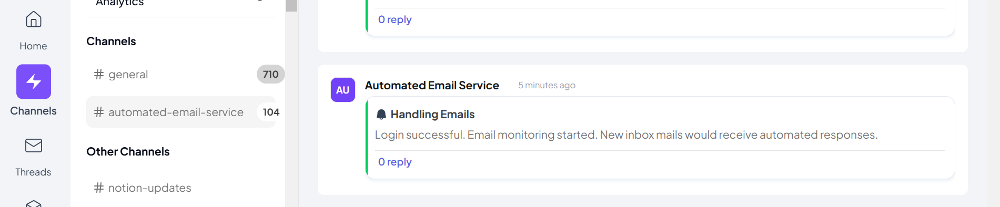
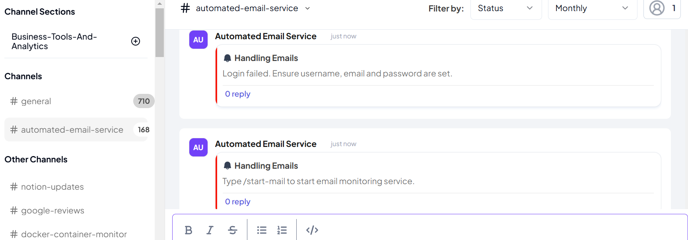
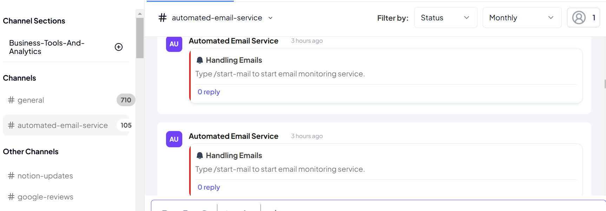

# 📧 Email Auto-Reply API

This API automatically sends an email reply when a message is received. It is designed to work with **Gmail** users, making integration simple by handling SMTP configuration internally.

It's hosted on [https://automated-gmail-service.onrender.com](https://automated-gmail-service.onrender.com)

## 🚀 Features

- 📩 **Auto-reply emails** to incoming messages
- 🔄 **Preconfigured SMTP settings** for Gmail
- 🔐 **Supports Two-Factor Authentication (2FA) users** via App Passwords
- 🌍 **Cross-Origin Resource Sharing (CORS) support**

---

## ⚙️ API Setup

### **1️⃣ Install Dependencies**

Ensure you have Go installed, then run:

```
go mod tidy
```

### **2️⃣ Start the API**

Run the server with:

```
go run main.go
```

#### 🔐 Using the API with 2FA-Enabled Accounts

We advise that **don't** use your regular **email password**. Instead, on your device navigate into Gmail and click on 'Manage your Google Account'. Locate the Security tab and click on it. Ensure you have enabled 2-step verification and generate an App Password from your email provider. This is what you'd use as your-app-password.

#### 🛠️ What is an App Password?

An App Password is a special password generated from your email provider’s security settings. It allows third-party applications (like this API) to send emails without disabling 2FA.

#### 🔑 How to Generate an App Password

Follow the steps below to create an App Password for Gmail and Outlook.

#### For Gmail Users

```
Go to Google App Passwords.
Select the app ("Mail") and device ("Other (Custom name)").
Click Generate – Google will provide you with a 16-character password.
Use this password instead of your real email password when making API requests.
```

### **How to use**

#### Install the integration using its JSON URL at:

```
https://automated-gmail-service.onrender.com/integration
```

#### Toggle the integration service ON and click on the MANAGE APP button. Choose settings and fill in the required fields:

```
Username: YourName
Email: youremail@gmail.com
Password: Your-Gmail-app-password
Webhook: Your-Channel-Webhook
```

Then, click on **'Save Settings'**

#### Go to Channels

Configure any of your channels to run this App Service. Then trigger the automated email service simply by sending the message "/start-mail" in that Telex channel. Every new mail that comes into your mailbox will get an automated response.

### Manual Tests

To initiate a request to the email service, you can make a POST request to [https://automated-gmail-service.onrender.com/target_url](https://automated-gmail-service.onrender.com/target_url)
with the following payload parameters:
```
{
  "settings": [
    {
      "default": "Your-Username",
      "label": "username",
      "required": true,
      "type": "text"
    },
    {
      "default": "yourEmailAddress@gmail.com",
      "label": "email",
      "required": true,
      "type": "text"
    },
    {
      "default": "your-gmail-app-password",
      "label": "password",
      "required": true,
      "type": "text"
    },
    {
      "default": "https://ping.telex.im/v1/webhooks/019533db-f47e-7d2e-8812-eea65373376a",
      "label": "webhook",
      "required": true,
      "type": "text"
    }
  ],
  "message": "/start-mail"
}
```

#### A successful authentication response would look like:

```
{
    "event_name": "Handling Emails",
    "message": "Login successful. Type a message to start email monitoring service.",
    "status": "success",
    "username": "Automated Email Service"
}
```

##### Your channel would send a notifcation of this format, if successful:


##### Or a response like this(with the error described) if you have an error:

